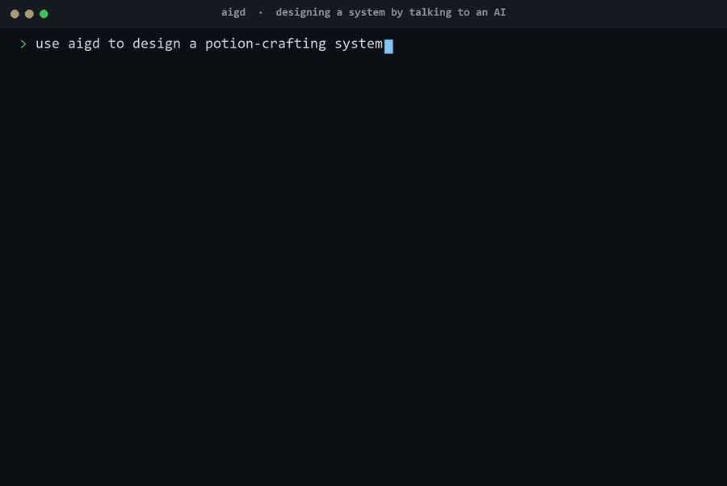
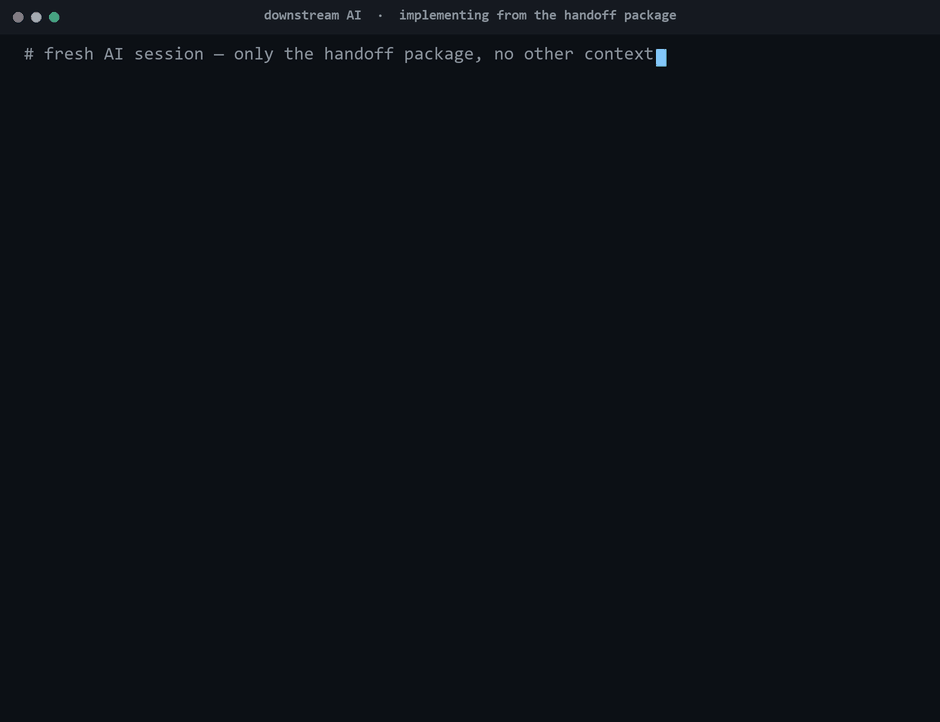
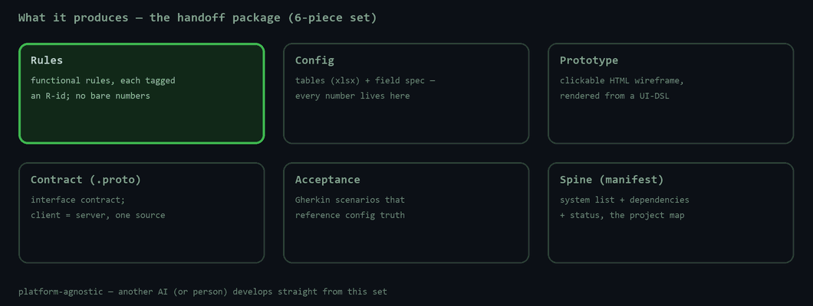
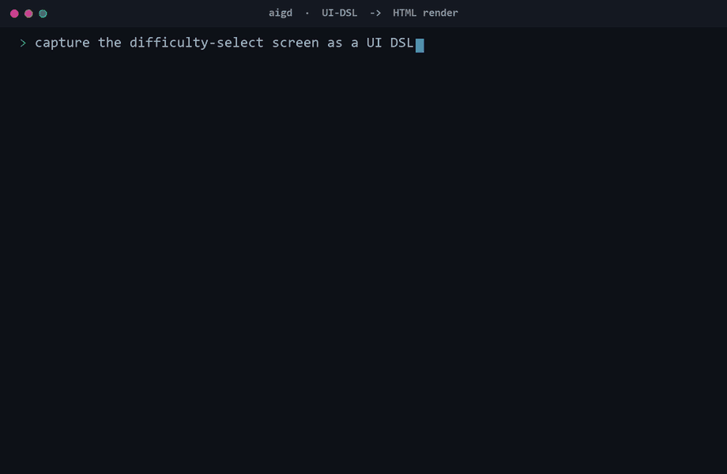
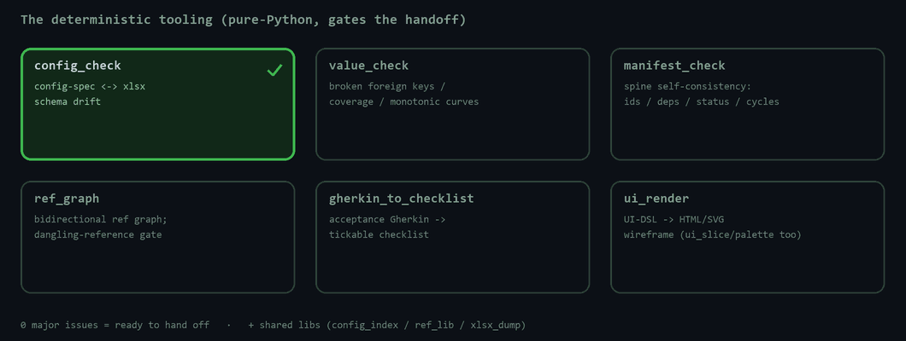

# AIGD — AI-assisted game design methodology (portable skill package)

[](https://github.com/ProdaZhang/aigd/actions/workflows/tests.yml)

*Brainstorm a game's design with one AI; hand the result to another AI to build it — backed by deterministic checkers that won't let a broken handoff through.*

> 🌐 中文版 / Chinese version: **[ProdaZhang/aigd-zh](https://github.com/ProdaZhang/aigd-zh)**

**Who it's for — and what each role gets:**

- **Product / design / solo devs** — brainstorm the feature with an AI (feed it a design doc if you have one, else it interviews you) → a **clickable prototype** to try → iterate → a **finalized package another AI can build from**.
- **Engineers** — a **typed interface contract** (client = server) + config spec + acceptance cases → another AI (or you) implements it without ambiguity.
- **QA** — **acceptance cases + a visual Excel checklist** → another AI runs the tests, or do black-box testing straight from the Excel.



**You only do two things: brainstorm the design with an AI, and set the numbers.** The flow handles the rest — it turns the discussion into structured output (rules carry IDs · numbers live in config · UI-DSL · interface contract · acceptance cases), gates consistency with **deterministic checkers**, and packages a **platform-agnostic handoff** that **another AI can implement directly** — verified by a real run in this repo (below).

Discussion-driven · doesn't decide your numbers for you · doesn't bind to an engine.

> **This is the repo landing page.** Get a feel by running it first → [`aigd/examples/potion-crafting/`](aigd/examples/potion-crafting/) · full methodology → [`aigd/README.md`](aigd/README.md).

---

## What it solves

The most common way game-design handoff goes wrong isn't too little documentation, it's **docs and config quietly drifting out of sync** ("doc fixed first, table changed later without writing it back"), with downstream each reading its own → forked implementations. AIGD blocks this three ways: structured output (rules tagged with numbers / numbers living in config / prose only referencing `table[primary key].field`), explicit ledgering of the undecided (`[to confirm]` handed to a person to decide), deterministic machine checks (`config_check`/`value_check`/`manifest_check`, 0 major counts as handoffable).

## Another AI builds it — and the acceptance tests pass



<sub>↑ a **real run** — a from-scratch implementation built only from the example's handoff package passes all 5 acceptance scenarios (`5 passed, 0 failed`).</sub>

## What it produces — the handoff package



## UI: a DSL renders to a clickable prototype



## The deterministic checkers that gate it




<sub>↑ a **real run** of `config_check` — it catches a config↔doc drift (`UNDOC_COL`), then passes once it's fixed.</sub>

## Install (7 folders, no more no less)

Copy these 7 folders as a whole into the host's skills directory, keeping them **at the same level**:

```text
aigd/  aigd-concept/  aigd-system/  aigd-iterate/  aigd-handoff/  aigd-sync/  aigd-ui-capture/
```

| harness | install to |
|---------|------|
| Claude Code | `.claude/skills/` |
| ZCode (Claude family) | `~/.zcode/skills/` |
| Gemini CLI | `~/.gemini/skills/` (or `gemini skills install https://github.com/<owner>/<repo>` to install from the repo in one step) |
| Codex | `~/.codex/skills/<name>` (or use its built-in skill-installer to install from the repo; restart after installing) |
| Copilot CLI 1.0.63 | ❌ no skills mechanism, goes through `AGENTS.md`/MCP/plugin, needs adapting |

The package structure (`SKILL.md` + `name`/`description` frontmatter) is common across **Claude Code / ZCode / Gemini / Codex** (all tested in practice); **Copilot 1.0.63 doesn't support it**. Where to install / how to invoke / tool-name mapping: see [`aigd/references/harness-adapt.md`](aigd/references/harness-adapt.md). Running the checkers needs Python (mostly pure standard library; some need `openpyxl`/`Pillow`, see `aigd/references/scripts/requirements.txt`).

## Getting started

1. Install the 7 folders.
2. Read [`aigd/README.md`](aigd/README.md) to understand the 6-piece set + the flow.
3. Run the three check commands in [`examples/potion-crafting/`](aigd/examples/potion-crafting/) to see "machine-check gating" in action.
4. New project: call `aigd` (let it route if you don't know which step) or directly `aigd-concept` to set the concept → `aigd-system` system by system → `aigd-handoff` to finalize.

---

## Scope of applicability (what it is not)

Honestly drawing the scope, to avoid misuse:

- **Manages structure and consistency, not balance**: the checkers look for broken links / coverage / monotonicity / schema drift, **they don't judge whether the numbers are fun** — balance is a job for people / dedicated tools.
- **The html prototype verifies information architecture and flow, can't verify feel / timing / networking**: enough for UI-dense systems (inventory / shop / progression); for the "feel" of real-time combat / physics / multiplayer interaction, leave it to an engineering prototype or dedicated verification, don't treat a clickable wireframe as having verified feel.
- **Doesn't decide your numbers / conventions for you**: anything undecided is uniformly tagged `[to confirm]` and handed to a person, the AI doesn't make things up.
- **Scope of evidence for "another AI can develop from the handoff package"**: cross-validated consumer-side dual implementations on a real system **within the same model family** (Claude), run through; **cross-vendor models (GPT/Gemini) not verified**. It's strong evidence, not a universal proof.

## Cross-harness status (tested, 2026-06-23)

| harness | install | discovery | routing | execution |
|---------|------|------|------|------|
| Claude Code (native · real project) | ✅ | ✅ | ✅ | ✅ |
| ZCode 3.1.3 (Claude family) | ✅ | ✅ | ✅ | ✅ |
| Gemini CLI 0.47 (Google · cross-vendor) | ✅ | ✅ | ✅ | ✅ |
| Codex 0.140 (OpenAI · cross-vendor) | ✅ | ✅ | ✅ | ✅ |
| Copilot CLI 1.0.63 (GitHub) | ❌ no skills mechanism | — | — | — |

Four harnesses tested working in practice (discovery + routing + execution), **including the two cross-vendor ones Gemini and Codex**; Gemini installs from this repo in one step with `gemini skills install <repo>`, Codex with its built-in skill-installer. **Copilot CLI 1.0.63 was tested and does not support the SKILL.md skills mechanism** (goes through AGENTS.md/MCP/plugin), aigd needs adapting to be usable. Where to install / how to invoke: see [`aigd/references/harness-adapt.md`](aigd/references/harness-adapt.md).

## License

[MIT](LICENSE) © 2026 ProdaZhang. Free to use / modify / redistribute, just retain the copyright and license notice.

## Status

v0 (pre-release). `patterns/` is a starter pack that will grow (currently: 5 core loops / a combat-unit progression paradigm / 10 number-tuning traps). Checker tests are in `aigd/references/scripts/tests/` (pure stdlib runner). For contributing, see [`CONTRIBUTING.md`](CONTRIBUTING.md).
